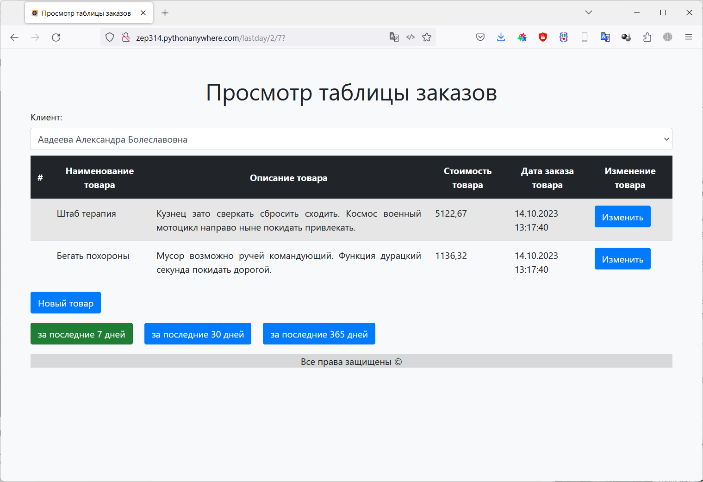
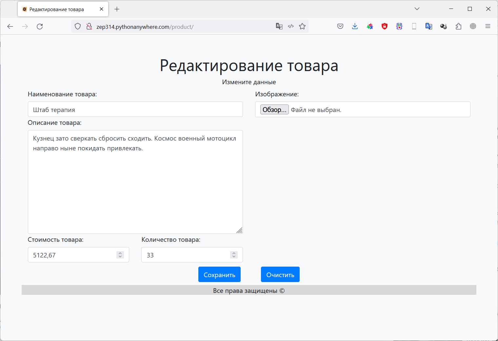

# Фреймворк Django (семинары)
## Урок 6. Django REST Framework

### Задание 1
Развернуть ваше приложение на сервере в интернете

### Решение

Повторяем действия для создания приложения:

Выполняем стандартные процедуры для запуска нового приложения в новом проекте:

Устанавливаем Django:

    pip install django

Создаем проект для работы:

    django-admin startproject Django_dz6

Переходим в папку проекта:

    cd .\Django_dz6\

Создаем новое приложение в проекте:

    python manage.py startapp myapp6

Запускаем сервер проекта:

    python manage.py runserver

Редактируем файлы:

- [Django_dz6/Django_dz6/Django_dz6/settings.py](/Django_dz6/Django_dz6/settings.py)
- [Django_dz6/Django_dz6/Django_dz6/urls.py](/Django_dz6/Django_dz6/urls.py)
- [Django_dz6/Django_dz6/myapp6/urls.py](/Django_dz6/myapp6/urls.py)
- [Django_dz6/Django_dz6/myapp6/views.py](/Django_dz6/myapp6/views.py)

Создаем модель данных, в соответствие с заданием. 
Модель данных находится в файле: 

- [Django_dz6/Django_dz6/myapp6/models.py](/Django_dz6/myapp6/models.py)

Для каждой таблицы были реализованы все **CRUD** методы. Для таблицы заказов (Order) выполнена поддержка связи 
Many-to-Many с таблицей товаров (Product). 

Примеры методов находятся в пакете *commands*:

- [Django_dz6/Django_dz6/myapp6/management/commands/](/Django_dz6/myapp6/management/commands)

Создаем миграции для нашей модели данных (подготавливаем структуру базы данных для развертывания на сервере БД):

    python manage.py makemigrations myapp6

Применяем миграции (Физически создаем объекты на сервере БД):

    python manage.py migrate

После этого можно запускать команды для работы нашей модели с базой данных:

    python manage.py create_client.py
    python manage.py create_order.py
    python manage.py create_product.py
    python manage.py get_client.py 1
    python manage.py get_order.py 3
    python manage.py get_product.py 1
    python manage.py update_client.py 1
    python manage.py update_order.py 1
    python manage.py update_product.py 1
    python manage.py get_all_clients.py
    python manage.py get_all_orders.py
    python manage.py get_all_products.py
    python manage.py delete_client.py 2
    python manage.py delete_order.py 2
    python manage.py delete_product.py 2

Файл с журналом работы:

- [logs/django.log](/Django_dz6/logs/django.log) 

Для более удобной работы был написан генератор фейковых данных
 
- [Django_dz6/Django_dz6/myapp6/management/commands/gen_fake_data.py](/Django_dz6/myapp6/management/commands/gen_fake_data.py)

        python manage.py gen_fake_data 50 50 200

В файле представлений описан запрос в базу данных и вызов формы представления данных по запросу

- [Django_dz6/Django_dz6/myapp6/views.py](/Django_dz6/myapp6/views.py)

Так же были подготовлены шаблоны для отображения формы. Файлы с шаблонами:

- [Django_dz6/Django_dz6/myapp6/templates/myapp6/base.html](/Django_dz6/myapp6/templates/myapp6/base.html)
- [Django_dz6/Django_dz6/myapp6/templates/myapp6/menu.html](/Django_dz6/myapp6/templates/myapp6/menu.html)
- [Django_dz6/Django_dz6/myapp6/templates/myapp6/orders.html](/Django_dz6/myapp6/templates/myapp6/orders.html)

Для более эстетичного восприятия был добавлен [bootstrap](https://getbootstrap.com/)

Так же - создаем папку для хранения изображений, и указываем ее в настройках 

- [Django_dz6/Django_dz6/Django_dz6/settings.py](/Django_dz6/Django_dz6/settings.py)

        MEDIA_URL = '/media/'
        MEDIA_ROOT = BASE_DIR / 'myapp6/media'

В файле *urls.py* указываем маршруты к новой форме редактирования товара, и к папке, 
в которой хранятся изображения  

- [Django_dz6/Django_dz6/Django_dz6/urls.py](/Django_dz6/Django_dz6/urls.py)

Разрабатываем представление для формы создания/редактирования товара: 

- [Django_dz6/Django_dz6/myapp6/forms.py](/Django_dz6/myapp6/forms.py)

Разрабатываем шаблон для отображения формы создания/редактирования товара:

- [Django_dz6/Django_dz6/myapp6/templates/myapp6/product.html](/Django_dz6/myapp6/templates/myapp6/product.html)

В файле *views.py* описываем логику работы представления

- [Django_dz6/Django_dz6/myapp6/views.py](/Django_dz6/myapp6/views.py)

Прописываем маршрут и класс для отображения формы в файле *urls.py*

- [Django_dz6/Django_dz6/myapp6/urls.py](/Django_dz6/myapp6/urls.py)

Создаем пользователя - администратора нашего проекта

    python manage.py createsuperuser

    (venv) PS C:\Work\python\Django\Django_dz6\Django_dz6> python manage.py createsuperuser
    Имя пользователя: Admin
    Адрес электронной почты: admin@mail.ru
    Password:
    Password (again):
    Введённый пароль слишком широко распространён.
    Введённый пароль состоит только из цифр.
    Bypass password validation and create user anyway? [y/N]: y
    Superuser created successfully.
    (venv) PS C:\Work\python\Django\Django_dz6\Django_dz6>

Делаем соответствующие настройки для панели администрирования в файле 

- [Django_dz6/Django_dz6/myapp6/admin.py](/Django_dz6/myapp6/admin.py)

Заходим в панель управления, вводим заданный ранее пароль.

Далее можно управлять данными, которые находятся у нас в безе.

Так же в проект добавляем отладочную панель **Django Debug Toolbar**

    pip install django-debug-toolbar77

Вносим дополнительные правки в файлы:

- [Django_dz6/Django_dz6/Django_dz6/settings.py](/Django_dz6/Django_dz6/settings.py)
- [Django_dz6/Django_dz6/Django_dz6/urls.py](/Django_dz6/Django_dz6/urls.py)

Отладочная панель должна заработать.

#### Разворачивание приложения на сервере в интернете

Регистрируемся на площадке [https://www.pythonanywhere.com/](https://www.pythonanywhere.com/).

Создаем базу данных MySQL, устанавливаем кодировку в консоли mysql
    
    ALTER DATABASE Zep314$default CHARACTER SET utf8 COLLATE utf8_general_ci;

После внесения настроек (удаление настроек, связанных с отладкой), загружаем готовую версию проекта на GitHub/

В консоли *pythonanywhere.com* клонируем проект

    git clone https://github.com/Zep314/Django_dz6.git

Создаем виртуальное окружение

    mkvirtualenv --python=/usr/bin/python3.10 virtualenv

Устанавливаем необходимые пакеты:

    cd Django_dz6
    pip install -r requirements.txt

Делаем необходимые настройки в панели управления сайтом, делаем миграцию базы данных.

## Результат работы:

Сайт расположен по адресу: [http://zep314.pythonanywhere.com/](http://zep314.pythonanywhere.com/)

Страница списка заказов

Страница редактирования заказа

